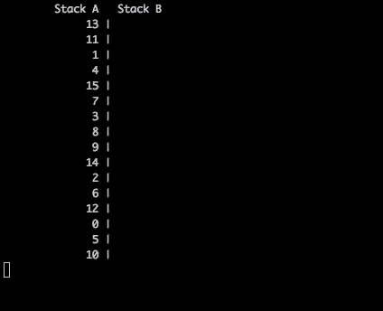
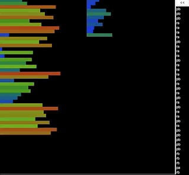

# push_swap

## Summary

The `push_swap` project involves sorting data on a stack with a limited set of instructions, aiming to use the lowest possible number of actions. You'll manipulate various algorithms and choose the most appropriate solution for optimized data sorting. The game is composed of two stacks, named `a` and `b`. The goal is to sort numbers in ascending order into stack `a` using a specific set of operations.

## Operations

- `sa`: swap a - swap the first 2 elements at the top of stack a. Do nothing if there is only one or no elements.
- `sb`: swap b - swap the first 2 elements at the top of stack b. Do nothing if there is only one or no elements.
- `ss`: sa and sb at the same time.
- `pa`: push a - take the first element at the top of b and put it at the top of a. Do nothing if b is empty.
- `pb`: push b - take the first element at the top of a and put it at the top of b. Do nothing if a is empty.
- `ra`: rotate a - shift up all elements of stack a by 1. The first element becomes the last one.
- `rb`: rotate b - shift up all elements of stack b by 1. The first element becomes the last one.
- `rr`: ra and rb at the same time.
- `rra`: reverse rotate a - shift down all elements of stack a by 1. The last element becomes the first one.
- `rrb`: reverse rotate b - shift down all elements of stack b by 1. The last element becomes the first one.
- `rrr`: rra and rrb at the same time.

## Checker Program

- The `checker` program reads the stack `a` formatted as a list of integers and waits for instructions on standard input.
- After executing the instructions, if stack `a` is sorted and `b` is empty, it displays "OK", otherwise "KO".
- Error handling includes checking for invalid inputs or incorrect instructions.

## push_swap Program

- The `push_swap` program receives stack `a` as a list of integers and displays the smallest list of instructions to sort stack `a`.
- The goal is to sort the stack with the minimum possible number of operations.
- Error handling includes checking for invalid inputs or duplicates.

## Bonus

- Possible bonuses include a debug option to display the stack's status after each operation or a color option to highlight the last operation.
- Additional features like reading/writing instructions from/to a file are allowed if compatible with the mandatory part.

## Visualized Examples

Below are visualized examples of the `push_swap` program in action:





## Usage

To compile the project, run the provided Makefile:

```bash
make
```

This will compile your project and create the `push_swap` and `checker` executables.

To use `push_swap`:

```bash
./push_swap [list_of_integers]
```

To use `checker`:

```bash
./checker [list_of_integers]
```

## Authors

Anouar Elissaoui

## Acknowledgments

This project was completed as part of the curriculum at 1337-School(42-Network).

## License

This project is licensed under the MIT License.
